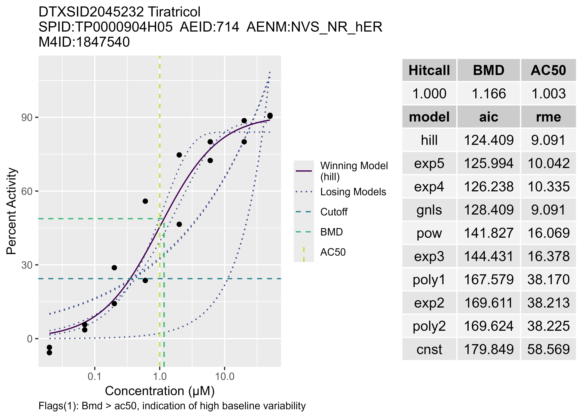

```{r eval=FALSE}
devtools::install_github("USEPA/CompTox-ToxCast-tcpl")
```

```{r}
library(tcpl)

```

The code block runs without problems but the **tcpPlot** function generates a jpg or other formats of figure which is directory in the working directory. So to  
```{r eval = FALSE}
# Load all matching spids and then subset using the aeid desired to find m4id
mc5 <- tcplLoadData(lvl = 5, 
                    fld = "spid",
                    val = "TP0000904H05",
                    type = "mc", 
                    add.fld = FALSE) # 8 rows of data
m4id <- mc5[aeid == 714]$m4id # subset to 1 aeid extract m4id

# Default parameters used here: fld = "m4id", type = "mc" (type can never be "sc" when connected to API)
tcplPlot(val = m4id, output = "jpg", verbose = TRUE, flags = TRUE)
```

{#fig-tcpPlot}

```{r eval = FALSE}
# Using the data pulled in the previous code chunk 'mc5'
m4id <- mc5$m4id # create m4id vector length == 8

# Default parameters used here: fld = "m4id", type = "mc" (type can never be "sc" when connected to API)
tcplPlot(val = m4id[1:4], compare.val = m4id[5:8], output = "pdf", verbose = TRUE, multi = TRUE, 
         flags = TRUE, yuniform = TRUE, fileprefix = "API_plot_compare")
```
<a href="assets/API_plot_compare.pdf">API plot compare</a>